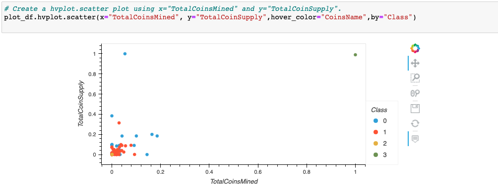

# Cryptocurrencies

## Overview
In the project, we would like to help Martha to better understand crytocurrencies since they want to offer their clients who interested incryptocurrency investment portfolio.we use unsuperviesd machine learing to learn about the crytocurrency and use it to transform the data to create an intuitive represtntation for analysis cryptocurrency investment. And it can better help us to understand of the cryptocurrencies being traded.

